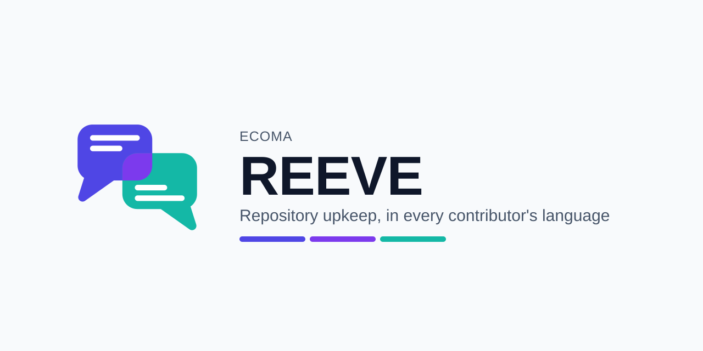

<p align="center">
  <a href="https://github.com/ecoma-io/reeve/actions/workflows/ci.yml"></a>
  <a href="https://github.com/ecoma-io/reeve/actions/workflows/analysis.yml"></a>
  <a href="https://scorecard.dev/viewer/?uri=github.com/ecoma-io/reeve"></a>
  <a href="LICENSE"></a>
  <a href="https://github.com/ecoma-io/reeve/releases/latest"></a>
  <a href="CONTRIBUTING.md"></a>
</p>

<p align="center">
  
</p>

<h1 align="center">Reeve</h1>

<p align="center">
  <strong>The best bug report you ever received was written in a language you do not read.</strong><br />
  Reeve keeps a repository's recurring work moving — sorting, matching, answering —<br />
  <em>in whatever language it arrived in, inside an authority you wrote down and it cannot exceed.</em>
</p>

<p align="center">
  Reeve labels, translates, deduplicates, and answers issues from inside your own
  warrant file — not a chatbot, not a hosted service, not a workflow engine.
</p>

<p align="center">
  <a href="#quick-start"><b>Quick start</b></a> ·
  <a href="#what-it-refuses-to-do"><b>What it refuses to do</b></a> ·
  <a href="docs/doctrine/north-star.md"><b>North star</b></a> ·
  <a href="docs/"><b>Documentation</b></a>
</p>

> [!IMPORTANT]
> **Reeve is being assembled, not announced.** It is on a `0.x` line: four
> duties ship, two of them — `triage` and `translate` — dogfooded on this
> repository, and the rest of [the roadmap](docs/doctrine/north-star.md#7-roadmap) is
> still open. `1.0` is the
> release where all of it is done — until then an input can still be renamed on
> a minor, and the release notes will say so.

## Quick start

```yaml
name: Reeve

on:
  issues:
    types: [opened, reopened, edited]

permissions:
  contents: read
  issues: write

jobs:
  triage:
    runs-on: ubuntu-latest
    steps:
      - uses: ecoma-io/reeve/triage@v0.1
        with:
          api-key: ${{ secrets.OPENAI_API_KEY }}
          models: gpt-5-mini

  translate:
    runs-on: ubuntu-latest
    steps:
      - uses: ecoma-io/reeve/translate@v0.1
        with:
          api-key: ${{ secrets.OPENAI_API_KEY }}
          models: gpt-5-mini
          languages: en, vi
```

One repository, one version line, one core — and each duty keeps its own inputs,
so nothing you write is meaningless to the thing you are configuring.

## What it refuses to do

The list is short, it is enforced in code, and it is the most important section
on this page.

|                                 |                                                                                                                                                                                                                                                                                                                       |
| ------------------------------- | --------------------------------------------------------------------------------------------------------------------------------------------------------------------------------------------------------------------------------------------------------------------------------------------------------------------- |
| **Act outside its warrant**     | What Reeve may do is a file in your repository, or its narrowest built-in default where you wrote no file at all. A label your taxonomy does not name is never applied; a capability you did not grant is never used. Checked against the file — never against the model's own claim about what it was allowed to do. |
| **Rewrite what a person wrote** | Titles and bodies belong to whoever wrote them. Machine output sits beside human text, marked, never in place of it.                                                                                                                                                                                                  |
| **Overrule a maintainer**       | It never removes a label, never reassigns, never reopens. It proposes; you decide.                                                                                                                                                                                                                                    |
| **Close, lock, or delete**      | Off by default and staying that way. Everything past the cheapest reversible action is opt-in, one at a time.                                                                                                                                                                                                         |
| **Write code**                  | Reeve reads and decides. It does not author diffs, run your tests, or fix your bugs. That is a different tool, and a crowded one.                                                                                                                                                                                     |
| **Guess when it cannot read**   | Model output that does not parse yields **no** result and a loud failure — not a best-effort read of the parts that looked fine. The shapes that fail to parse are the ones an injection produced.                                                                                                                    |
| **Pretend it worked**           | A run that cannot do its job fails red. It never reports an empty result in green to mean something went wrong.                                                                                                                                                                                                       |
| **Hold your data**              | No account, no dashboard, no hosted state. Taxonomy, corrections, configuration and markers are plain files in your repository — reviewed in a pull request, and deleted with `rm`.                                                                                                                                   |

## Duties, and the ladder they sit on

A **duty** is one job Reeve does, and none of them is switched on by a mode —
what runs is exactly as much as you wrote down, one rung of
[the ladder](docs/concepts/authority-model.md) at a time. Every duty shares a
core — the provider client and its fallback, the language layer, several
drafts filtered by deterministic scoring, the sanitiser, the allowlist, the
state kept as files in your repository — and differs only in what it decides:

| Duty        | What it does                                                                                                                                                                 | Reference                                       |
| ----------- | ---------------------------------------------------------------------------------------------------------------------------------------------------------------------------- | ----------------------------------------------- |
| `triage`    | Sorts a backlog against the taxonomy you wrote — or, at the bottom rung, against the labels your repository already has.                                                     | [Reference](docs/reference/duties/triage.md)    |
| `translate` | Puts every issue and pull request in every language your project reads — in the thread's own body, marked as the version that counts.                                        | [Reference](docs/reference/duties/translate.md) |
| `duplicate` | Finds the thread that already reported this — across the language it was reported in. Top rung: opt-in, never on by accident.                                                | [Reference](docs/reference/duties/duplicate.md) |
| `respond`   | Gives a stranger a first, useful reply in the language they wrote to you in, grounded in what the project already knows. Top rung: granted nothing until a warrant names it. | [Reference](docs/reference/duties/respond.md)   |

## Cost

Reeve is arranged so the expensive step runs last and least: code decides the
easy majority for nothing, a cheap model screens what survives that, and only
the minority that was always worth a careful read reaches the model you chose.

| Tier                    | Decides                                                                                       | Costs         |
| ----------------------- | --------------------------------------------------------------------------------------------- | ------------- |
| **Code**                | Empty bodies, unfilled templates, obvious spam, exact repeats, a thread Reeve already handled | Nothing       |
| **A cheap model**       | Is this worth a careful read — spam, off-topic, out of scope                                  | Very little   |
| **The model you chose** | The actual verdict, on what survived                                                          | The real bill |

Providers serving OpenAI-compatible models with no key at all are a supported
configuration, not a tolerated one: point `base-url` at one and give Reeve
several models. Full breakdown, including a worked estimate and how to measure
it instead of estimating it: [Cost](docs/guides/cost.md).

## Documentation

[`docs/`](docs/) is the full index, organized by who's reading. Start here:

| If you are…                  | Start at                                                |
| ---------------------------- | ------------------------------------------------------- |
| New to Reeve                 | [Getting started](docs/getting-started/installation.md) |
| Deciding whether to adopt it | [The authority model](docs/concepts/authority-model.md) |
| Running it day to day        | [Guides](docs/guides/warrant.md)                        |
| Reviewing it for security    | [Threat model](docs/security/threat-model.md)           |
| Changing the code            | [Development](docs/development/README.md)               |

## License

[Apache-2.0](LICENSE).

---

<p align="center">
  <br />
  <sub>
    Reeve is developed at <a href="https://github.com/ecoma-io/reeve">github.com/ecoma-io/reeve</a>.
  </sub>
</p>
